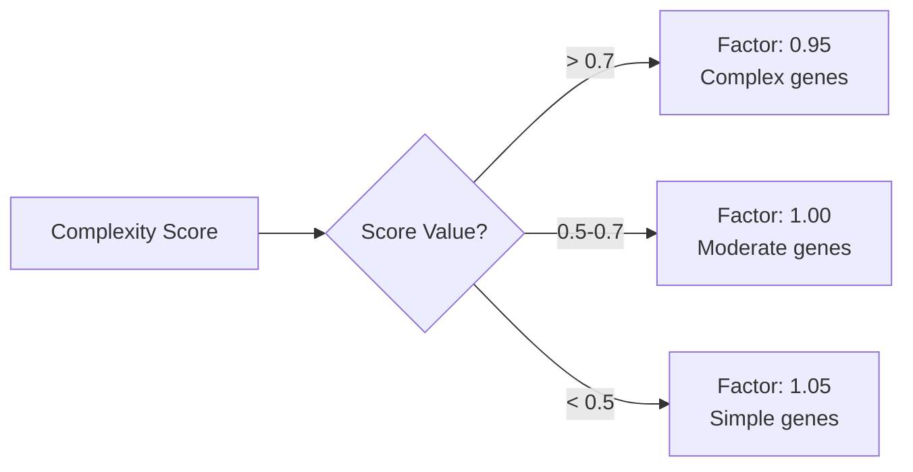
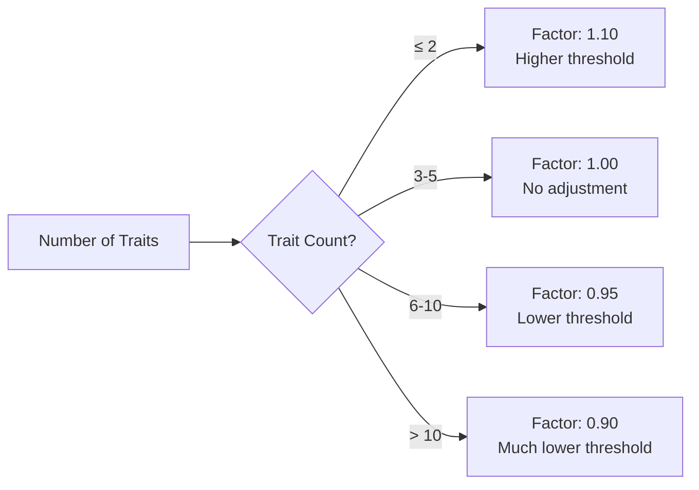
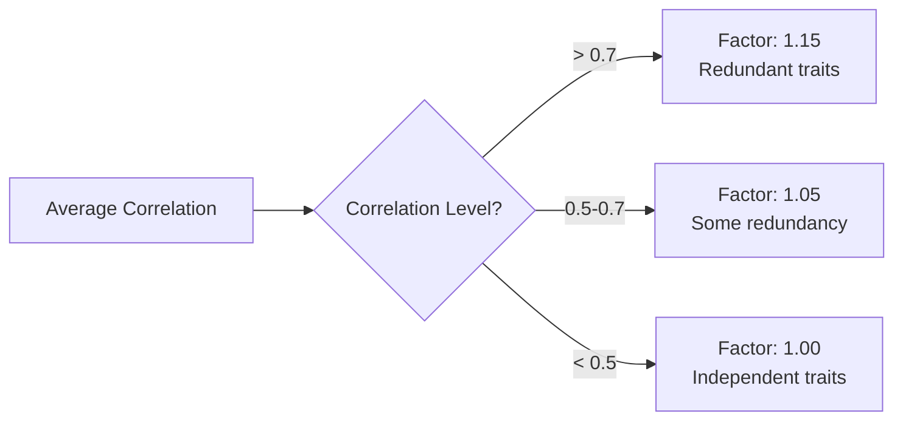
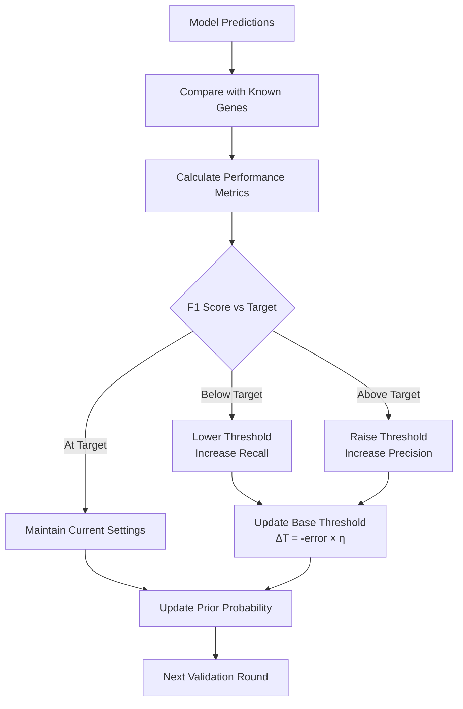
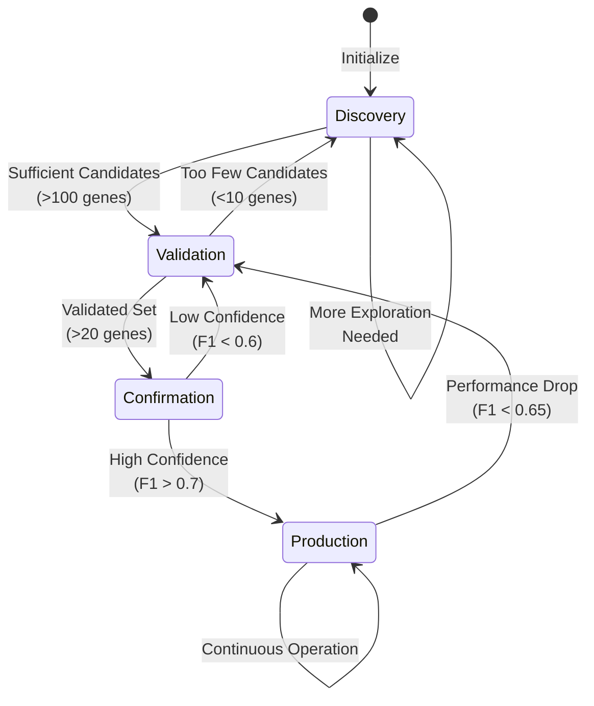

# Adaptive Confidence Protocol Flowchart

## Overview
This flowchart illustrates the adaptive confidence threshold system for pleiotropic gene detection.

```mermaid
graph TB
    Start([Start Detection Process]) --> Phase{Determine Detection Phase}
    
    Phase --> |Discovery| D[Discovery Phase<br/>Base: 0.35<br/>Range: 0.25-0.45]
    Phase --> |Validation| V[Validation Phase<br/>Base: 0.55<br/>Range: 0.45-0.65]
    Phase --> |Confirmation| C[Confirmation Phase<br/>Base: 0.75<br/>Range: 0.65-0.85]
    Phase --> |Production| P[Production Phase<br/>Base: 0.70<br/>Range: 0.60-0.80]
    
    D --> GeneAnalysis[Analyze Gene Context]
    V --> GeneAnalysis
    C --> GeneAnalysis
    P --> GeneAnalysis
    
    GeneAnalysis --> GeneMetrics[Calculate Gene Metrics<br/>- Length<br/>- GC Content<br/>- Codon Complexity<br/>- Regulatory Elements<br/>- Conservation Score]
    
    GeneMetrics --> ComplexityScore[Compute Complexity Score<br/>weighted combination]
    
    ComplexityScore --> TraitAnalysis[Analyze Trait Context]
    
    TraitAnalysis --> TraitFactors[Calculate Trait Factors<br/>- Number of traits<br/>- Trait correlations<br/>- Background noise]
    
    TraitFactors --> MethodScores[Collect Method Scores]
    
    MethodScores --> EnsembleVoting[Ensemble Voting<br/>- Frequency Analysis: 30%<br/>- Pattern Detection: 25%<br/>- Regulatory Context: 25%<br/>- Statistical Significance: 20%]
    
    EnsembleVoting --> BayesianUpdate[Bayesian Adjustment<br/>P(pleiotropic|evidence)]
    
    BayesianUpdate --> ThresholdCalc[Calculate Adaptive Threshold<br/>T = T_base × Π(adjustments)]
    
    ThresholdCalc --> BoundsCheck{Within Bounds?}
    
    BoundsCheck --> |No| Clip[Clip to Phase Bounds]
    BoundsCheck --> |Yes| ApplyThreshold[Apply Threshold]
    Clip --> ApplyThreshold
    
    ApplyThreshold --> Detection[Detect Pleiotropic Genes<br/>Score ≥ Threshold]
    
    Detection --> Validation{Validation Data<br/>Available?}
    
    Validation --> |Yes| ValidationMetrics[Calculate Metrics<br/>- Precision/Recall<br/>- F1 Score<br/>- MCC<br/>- AUC-ROC]
    Validation --> |No| Results[Output Results]
    
    ValidationMetrics --> UpdateProtocol[Update Protocol<br/>- Adjust base threshold<br/>- Update prior probability<br/>- Refine ensemble weights]
    
    UpdateProtocol --> LearningCheck{Converged?}
    
    LearningCheck --> |No| PhaseTransition{Phase Complete?}
    LearningCheck --> |Yes| SaveState[Save Protocol State]
    
    PhaseTransition --> |No| GeneAnalysis
    PhaseTransition --> |Yes| NextPhase[Advance to Next Phase]
    
    NextPhase --> Phase
    SaveState --> Results
    
    Results --> End([End])
```

## Adjustment Factor Details

### Gene Complexity Adjustment


### Trait Count Adjustment


### Correlation Adjustment


## Validation Feedback Loop



## Background Noise Estimation

```mermaid
graph TD
    Scores[Confidence Scores] --> NoiseMethod{Known Negatives?}
    
    NoiseMethod --> |Yes| UseNegatives[Calculate from<br/>Negative Controls]
    NoiseMethod --> |No| GMM[Gaussian Mixture Model<br/>2 Components]
    
    UseNegatives --> Percentile[95th Percentile<br/>of Negative Scores]
    GMM --> Components[Identify Noise Component<br/>Lower Mean]
    
    Components --> NoiseStats[Calculate Noise Stats<br/>μ + 1.645σ]
    Percentile --> SetNoise[Set Background<br/>Noise Level]
    NoiseStats --> SetNoise
    
    SetNoise --> AdjustThreshold[Apply Noise Adjustment<br/>T × (1 + 0.5 × noise)]
```

## Phase Transition Logic



## Key Decision Points

1. **Phase Selection**: Based on analysis maturity and data availability
2. **Threshold Calculation**: Multiple context-aware adjustments
3. **Bounds Checking**: Ensure threshold stays within phase limits
4. **Validation Integration**: Continuous learning from results
5. **Convergence Detection**: Determine when to stop adaptation

## Implementation Notes

- All adjustment factors are multiplicative
- Thresholds are always clipped to phase bounds
- Learning rate decreases over time for stability
- State is persisted between runs for continuity