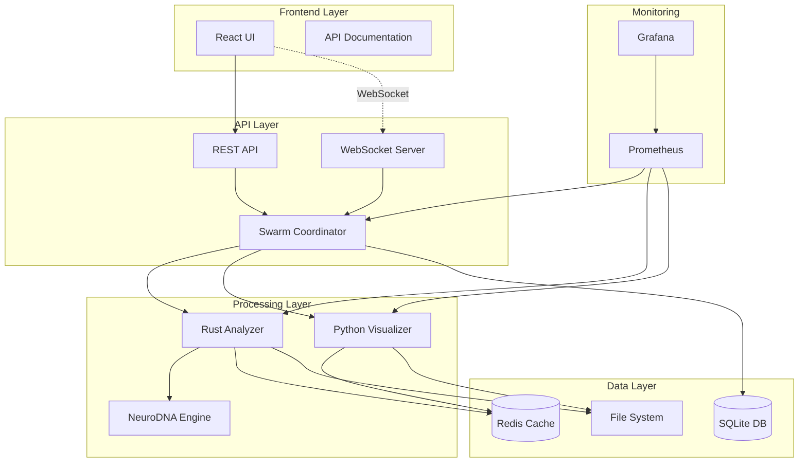
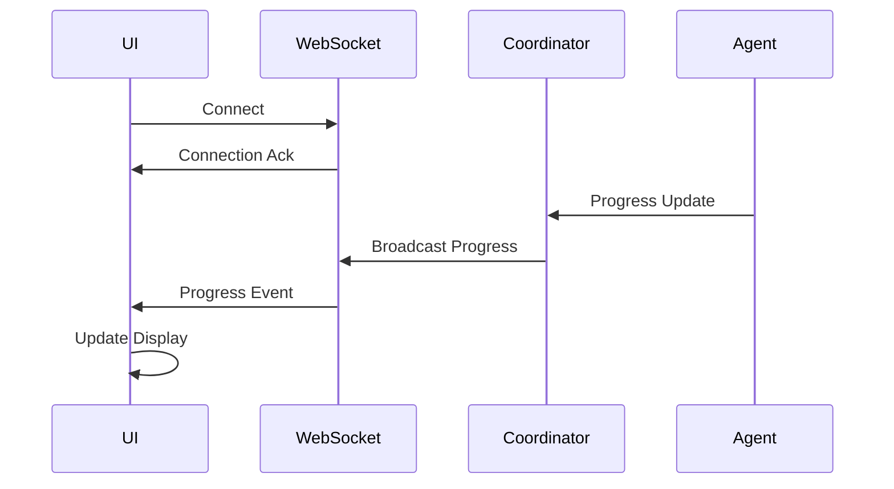
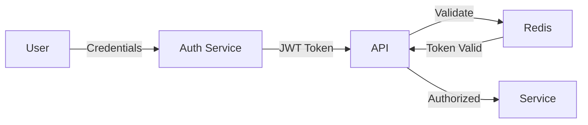

# System Architecture

## 🏗️ Overview

The Genomic Pleiotropy Cryptanalysis system is built as a distributed microservices architecture, combining high-performance Rust components for computational tasks with Python services for analysis and visualization.



## 🧩 Core Components

### 1. Rust Analyzer (`rust_impl/`)

The computational heart of the system, written in Rust for maximum performance.

#### Key Modules

- **`sequence_parser.rs`**: Handles FASTA/FASTQ parsing
- **`frequency_analyzer.rs`**: Codon frequency calculations
- **`crypto_engine.rs`**: Core cryptanalytic algorithms
- **`neurodna_trait_detector.rs`**: NeuroDNA integration for ML-based detection
- **`trait_extractor.rs`**: Trait pattern identification

#### Design Principles
- Zero-copy parsing where possible
- Parallel processing with Rayon
- Memory-mapped files for large genomes
- SIMD optimizations for frequency calculations

```rust
// Example: Parallel codon frequency calculation
pub fn calculate_frequencies(&self, sequences: &[Sequence]) -> FrequencyTable {
    sequences.par_iter()
        .map(|seq| self.analyze_sequence(seq))
        .reduce(FrequencyTable::new, |a, b| a.merge(b))
}
```

### 2. Python Analysis (`python_analysis/`)

Provides statistical analysis and visualization capabilities.

#### Components

- **`statistical_analyzer.py`**: Advanced statistical tests
- **`trait_visualizer.py`**: Interactive visualizations
- **`rust_interface.py`**: Bridge to Rust components

#### Key Features
- Chi-squared tests for codon bias
- PCA for dimensionality reduction
- Interactive plots with Plotly
- Publication-ready figures

### 3. Swarm Coordinator (`trial_database/swarm/`)

Orchestrates distributed agent execution.

#### Architecture
```python
class SwarmCoordinator:
    def __init__(self):
        self.redis_client = Redis()
        self.agents = {}
        self.task_queue = PriorityQueue()
    
    async def distribute_task(self, task):
        agent = self.select_best_agent(task)
        await agent.execute(task)
```

#### Agent Types
1. **Database Architect**: Schema design and migrations
2. **API Developer**: Endpoint implementation
3. **UI Engineer**: Frontend components
4. **Integration Specialist**: System integration
5. **QA Engineer**: Testing and validation

### 4. Trial Database System

#### Database Schema

```sql
-- Core tables
CREATE TABLE trials (
    id INTEGER PRIMARY KEY,
    name TEXT NOT NULL,
    parameters JSON,
    hypothesis TEXT,
    created_at TIMESTAMP,
    status TEXT
);

CREATE TABLE results (
    id INTEGER PRIMARY KEY,
    trial_id INTEGER REFERENCES trials(id),
    confidence_score REAL,
    detected_genes JSON,
    analysis_time REAL,
    created_at TIMESTAMP
);

CREATE TABLE agents (
    id INTEGER PRIMARY KEY,
    name TEXT UNIQUE,
    type TEXT,
    status TEXT,
    last_heartbeat TIMESTAMP
);

CREATE TABLE progress (
    id INTEGER PRIMARY KEY,
    trial_id INTEGER REFERENCES trials(id),
    agent_id INTEGER REFERENCES agents(id),
    progress REAL,
    message TEXT,
    timestamp TIMESTAMP
);
```

### 5. Web UI (`trial_database/ui/`)

Modern React application with TypeScript.

#### Tech Stack
- **Framework**: React 18 with TypeScript
- **State Management**: Context API + Hooks
- **UI Library**: Material-UI v5
- **Charts**: Chart.js with react-chartjs-2
- **WebSocket**: Native WebSocket API
- **Build Tool**: Vite

#### Component Architecture
```typescript
interface AppState {
  trials: Trial[];
  agents: Agent[];
  progress: Progress[];
  websocket: WebSocket | null;
}

const AppContext = createContext<AppState>({...});

function Dashboard() {
  const { trials, agents } = useContext(AppContext);
  return (
    <>
      <TrialList trials={trials} />
      <AgentStatus agents={agents} />
      <ProgressChart />
    </>
  );
}
```

## 🔄 Data Flow

### Analysis Pipeline

1. **Input Stage**
   ```
   User Upload → Validation → File Storage → Task Creation
   ```

2. **Processing Stage**
   ```
   Task Queue → Agent Selection → Rust Analysis → Result Generation
   ```

3. **Output Stage**
   ```
   Results → Visualization → Storage → User Delivery
   ```

### Real-time Updates



## 🔐 Security Architecture

### Authentication Flow



### Security Layers

1. **Network Security**
   - HTTPS/WSS for all communications
   - CORS configuration
   - Rate limiting

2. **Application Security**
   - JWT authentication
   - Role-based access control
   - Input validation
   - SQL injection prevention

3. **Data Security**
   - Encryption at rest
   - Secure file handling
   - Audit logging

## 📊 Performance Optimization

### Caching Strategy

```yaml
Cache Layers:
  L1: In-memory (Rust structs)
  L2: Redis (shared across services)
  L3: Disk cache (large files)

Cache Keys:
  - frequency_table:{genome_hash}
  - trait_patterns:{trait_id}
  - analysis_results:{trial_id}
```

### Parallelization

1. **Rust Level**: Rayon for CPU parallelism
2. **Service Level**: Multiple agent instances
3. **Task Level**: Concurrent analysis jobs

### Resource Management

```rust
// Memory pool for sequence processing
lazy_static! {
    static ref SEQUENCE_POOL: Pool<Vec<u8>> = Pool::new(32, || Vec::with_capacity(1_000_000));
}

// Bounded channels for backpressure
let (tx, rx) = bounded::<Task>(100);
```

## 🐳 Deployment Architecture

### Container Structure

```yaml
services:
  coordinator:
    build: ./trial_database/swarm
    depends_on: [redis, rust_analyzer, python_visualizer]
    
  rust_analyzer:
    build: ./rust_impl
    volumes:
      - data:/data
      - results:/results
    
  python_visualizer:
    build: ./python_analysis
    volumes:
      - results:/results
      - visualizations:/viz
    
  web_ui:
    build: ./trial_database/ui
    ports:
      - "3000:80"
    
  redis:
    image: redis:7.2-alpine
    volumes:
      - redis_data:/data
```

### Scaling Strategy

#### Horizontal Scaling
```bash
# Scale analyzers based on load
docker-compose up -d --scale rust_analyzer=3 --scale python_visualizer=2
```

#### Vertical Scaling
```yaml
deploy:
  resources:
    limits:
      cpus: '4.0'
      memory: 8G
    reservations:
      cpus: '2.0'
      memory: 4G
```

## 🔌 Integration Points

### External Services

1. **Genomic Databases**
   - NCBI GenBank
   - Ensembl
   - UniProt

2. **Cloud Storage**
   - AWS S3 for large files
   - Google Cloud Storage
   - Azure Blob Storage

3. **Monitoring**
   - Prometheus metrics
   - Grafana dashboards
   - Custom alerts

### API Integration

```typescript
// Example: External database integration
class NCBIIntegration {
  async fetchGenome(accession: string): Promise<Genome> {
    const response = await fetch(
      `https://eutils.ncbi.nlm.nih.gov/entrez/eutils/efetch.fcgi?db=nuccore&id=${accession}&rettype=fasta`
    );
    return this.parseGenome(await response.text());
  }
}
```

## 🎯 Design Patterns

### 1. Repository Pattern
```python
class TrialRepository:
    def __init__(self, db):
        self.db = db
    
    def create(self, trial_data):
        # Business logic here
        return self.db.insert('trials', trial_data)
```

### 2. Strategy Pattern
```rust
trait AnalysisStrategy {
    fn analyze(&self, sequence: &Sequence) -> AnalysisResult;
}

struct NeuroDNAStrategy;
struct CryptoStrategy;

impl AnalysisStrategy for NeuroDNAStrategy {
    fn analyze(&self, sequence: &Sequence) -> AnalysisResult {
        // NeuroDNA-specific implementation
    }
}
```

### 3. Observer Pattern
```javascript
class ProgressObserver {
  constructor() {
    this.subscribers = [];
  }
  
  subscribe(callback) {
    this.subscribers.push(callback);
  }
  
  notify(progress) {
    this.subscribers.forEach(cb => cb(progress));
  }
}
```

## 🔮 Future Architecture

### Planned Enhancements

1. **Kubernetes Migration**
   - Helm charts for deployment
   - Auto-scaling based on metrics
   - Service mesh integration

2. **Event-Driven Architecture**
   - Apache Kafka for event streaming
   - Event sourcing for audit trail
   - CQRS for read/write separation

3. **Serverless Components**
   - Lambda functions for small tasks
   - Step Functions for workflows
   - API Gateway for rate limiting

---

*For implementation details, see the [source code](https://github.com/murr2k/pleiotropy) and [API Reference](API-Reference).*